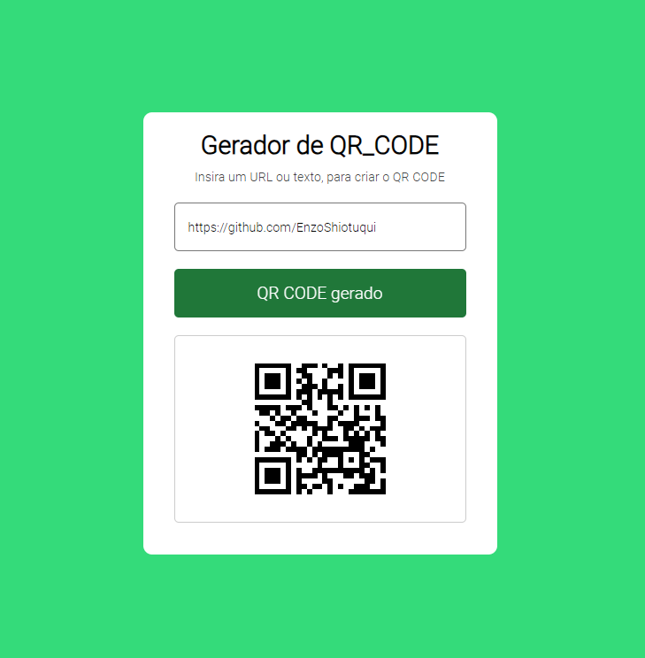

# QR_CODE Generator

a qrcode generator made with front end technologies, which allows you to generate qrcodes of photos, videos, audios 

## Tech Stack

**Client:** HTML, CSS, JavaScript, API


## Link

- [Deploy-Site](https://enzoshiotuqui.github.io/QR_CODE_GENERATOR/)

## Run Locally

Clone the project

```bash
  git clone https://link-to-project
```

Go to the project directory

```bash
  cd my-project
```

Open with live server


## ScreenShot




## Authors

- [@enzoshiotuqui](https://github.com/EnzoShiotuqui)
